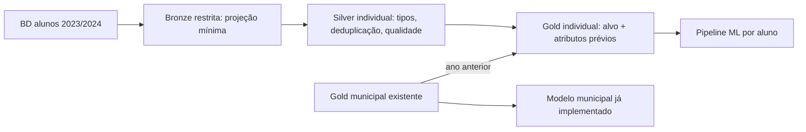

# Evolução da arquitetura medalhão para a Fase 3

## Estado da fonte e da Fase 2

A Base dos Dados informa cobertura 2023–2024 para a Avaliação da Alfabetização. A Fase 2 consulta microdados da tabela `alunos`, mas os agrega no BigQuery por ano, município e rede antes da Bronze. Assim, a Silver e a Gold guardam apenas grupos anônimos. O mart municipal atual é adequado para previsão de risco territorial, não para classificação individual.

## Mudança proposta

1. **Bronze individual restrita:** os microdados permanecem na tabela de origem do BigQuery, em `US`; não são copiados para Parquet local, GCS ou Git.
2. **Silver individual lógica:** a consulta SQL normaliza ano, município, rede, série, presença e `alfabetizado` e deduplica pela chave original em CTE. Evita extrair milhões de linhas em Pandas.
3. **Gold individual:** uma linha por aluno presente e com rótulo válido em 2024. Atributos permitidos: contexto territorial, rede, série e indicadores **municipais de 2023**. `alfabetizado` é o alvo. A tabela `sharp-gecko-439920-j4.alfabetizacao_gold_ml.mart_alfabetizacao_aluno` está em `US` e não publica identificadores de aluno ou escola.
4. **Gold municipal:** manter os quatro marts da Fase 2. O modelo já criado continua respondendo ao risco de município não atingir meta.

## Vazamento e validade

- **Não usar** `proficiencia`, porque o rótulo `alfabetizado` é determinado pelo limiar de proficiência de 743 pontos. Também não usar taxas, rankings, gaps ou metas calculados com o resultado de 2024 como atributos da predição de 2024.
- `presenca` só define a população avaliada; não é atributo preditivo. `peso_aluno` e `preenchimento_caderno` ficam fora até confirmar que seriam conhecidos no instante da predição.
- Dividir treino, validação e teste por **município**, mantendo todos os alunos de um município em um único conjunto. Com a fonte atual, isso mede transferência entre municípios em 2024, não generalização temporal.
- Há poucos atributos próprios do aluno que sejam conhecidos antes da avaliação. As previsões tenderão a ser **risco contextual**, parecido entre alunos do mesmo município/rede/série. Para um modelo verdadeiramente individual, incorporar dados educacionais prévios por aluno exigiria uma fonte longitudinal com vínculo confiável, autorização e governança de privacidade.
- A origem da Base dos Dados está em `US`, enquanto a Gold municipal da Fase 2 está em `us-central1`. Para evitar cruzamento entre regiões, apenas 11.547 linhas **agregadas** do contexto municipal de 2023 foram carregadas para `US`. O script `build_student_gold.py` não substitui a Gold individual se ela já existir.

## Próxima implementação

A Gold individual foi materializada e validada: 1.852.788 linhas, das quais 1.817.206 têm contexto municipal anterior; 1.107.119 têm rótulo alfabetizado e 745.669 não alfabetizado. `train_students.py` consulta apenas 12.989 grupos de atributos e rótulo, pondera cada grupo pela contagem de alunos e divide municípios entre treino, validação e teste. O modelo municipal atual não deve ser apresentado como se resolvesse o alvo individual do enunciado.

O modelo individual contextual obteve ROC-AUC 0,643 e acurácia 0,615 no teste de 330.968 alunos de municípios não vistos. A classe majoritária no teste corresponde a 61,9% dos alunos, portanto a acurácia do modelo não supera esse baseline. O Brier score foi 0,221. Isso mostra que a base agora atende ao **grão** individual, mas os atributos disponíveis antes da avaliação ainda são insuficientes para uma previsão individual forte.
