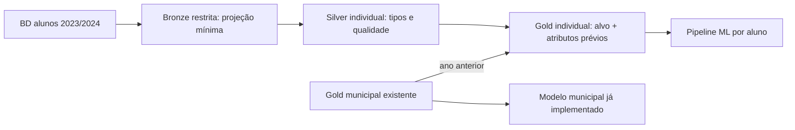

# Evolução da arquitetura medalhão para a Fase 3

## Estado da fonte e da Fase 2

A Base dos Dados informa cobertura 2023–2024 para a Avaliação da Alfabetização. A Fase 2 consulta microdados da tabela `alunos`, mas os agrega no BigQuery por ano, município e rede antes da Bronze. Assim, a Silver e a Gold guardam apenas grupos anônimos. O mart municipal atual é adequado para previsão de risco territorial, não para classificação individual.

## Mudança proposta

1. **Bronze individual restrita:** os microdados permanecem na tabela de origem do BigQuery, em `US`; não são copiados para Parquet local, GCS ou Git.
2. **Silver individual lógica:** a consulta SQL normaliza ano, município, rede, série, presença e `alfabetizado` e bloqueia a execução se a auditoria detectar duplicação da chave original. Evita extrair milhões de linhas em Pandas.
3. **Gold individual:** uma linha por aluno presente e com rótulo válido em 2024. Atributos permitidos: contexto territorial, rede, série e indicadores **municipais de 2023**. `alfabetizado` é o alvo. A tabela `sharp-gecko-439920-j4.alfabetizacao_gold_ml.mart_alfabetizacao_aluno` está em `US` e não publica identificadores de aluno ou escola.
4. **Gold municipal:** manter os quatro marts da Fase 2. O modelo já criado continua respondendo ao risco de município não atingir meta.

## Vazamento e validade

- **Não usar** `proficiencia`, porque o rótulo `alfabetizado` é determinado pelo limiar de proficiência de 743 pontos. Também não usar taxas, rankings, gaps ou metas calculados com o resultado de 2024 como atributos da predição de 2024.
- `presenca` só define a população avaliada; não é atributo preditivo. `peso_aluno` e `preenchimento_caderno` ficam fora até confirmar que seriam conhecidos no instante da predição.
- Dividir treino, validação e teste por **município**, mantendo todos os alunos de um município em um único conjunto. Com a fonte atual, isso mede transferência entre municípios em 2024, não generalização temporal.
- Há poucos atributos próprios do aluno que sejam conhecidos antes da avaliação. As previsões tenderão a ser **risco contextual**, parecido entre alunos do mesmo município/rede/série. Para um modelo verdadeiramente individual, incorporar dados educacionais prévios por aluno exigiria uma fonte longitudinal com vínculo confiável, autorização e governança de privacidade.
- A origem da Base dos Dados está em `US`, enquanto a Gold municipal da Fase 2 está em `us-central1`. Para evitar cruzamento entre regiões, apenas 11.547 linhas **agregadas** do contexto municipal de 2023 foram carregadas para `US`. O script `build_student_gold.py` não substitui a Gold individual se ela já existir.

## Implementação concluída

A Gold individual contém 1.852.788 observações elegíveis de 2024, sem identificadores individuais publicados. A tabela `mart_modelagem_aluno_perfis_v2` integra PIB/composição econômica de 2021 e população de 2022, formando 12.989 perfis de atributos e rótulo. A contagem `peso` preserva todos os alunos elegíveis; não é peso amostral do Inep. A tabela de perfis, a Gold individual e o contexto municipal de 2023 estão em `US`.

`prepare_data.py` prepara o cache, e `run_project.py` executa EDA, pré-processamento integrado, comparação de modelos, validação por município, interpretação e análises estratégicas. Ambos funcionam com Run Python File no VS Code.

A entrega final selecionou regressão logística na validação. No teste de 330.968 observações, ROC-AUC 0,649 e Brier 0,220; no limiar 0,5 a acurácia é 65,1%, contra 61,9% do baseline. O limiar de risco 0,38 escolhido na validação aumenta o recall para 69,6%, com precisão de 46,9% e acurácia de 58,3%. Resultados antigos do modelo municipal não substituem essas métricas.

O desenho mede transferência entre municípios de 2024 e permanece exploratório. Os cenários para metas de 2025 são comparações condicionais com o resultado observado de 2024, sem previsão temporal validada. Os valores históricos estão na versão atualmente consultada das fontes; datas exatas de publicação dos indicadores educacionais não foram recuperadas.
