# Relatório técnico — Alfabetização no Brasil

Execução UTC: 2026-09-14T13:12:39.830892+00:00

## Problema e objetivo

O Tech Challenge pede classificar se um aluno será considerado alfabetizado. A população analisada é a dos alunos presentes com rótulo válido na avaliação de 2024. O alvo 1 representa alfabetizado; nas métricas de priorização, a classe de interesse é o risco de não alfabetização. O propósito é apoiar investigação territorial e organização de apoio pedagógico.

## Base, população e arquitetura

A fonte contém 3.867.999 registros: 1.747.439 em 2023 e 2.120.560 em 2024. Após selecionar presentes com rótulo 0/1, a Gold tem 1,852,788 observações de 2024 em 5,517 municípios. A auditoria não encontrou chaves duplicadas ou identificadores nulos na população original consultada de 2024. A Gold não publica IDs de aluno ou escola. As 12,989 linhas locais são perfis de atributos e rótulo, cada um com uma contagem. Não houve amostragem de alunos: todas as observações elegíveis estão representadas.

## Linhagem e momento de disponibilidade

A Gold municipal construída na Fase 2 fornece alfabetização, média de português, presença e quantidade de alunos de 2023. PIB e composição do valor adicionado de 2021 e população de 2022 fornecem contexto econômico e demográfico. PIB per capita usa PIB e população do mesmo ano, 2021. A participação da administração pública inclui administração, defesa, educação e saúde públicas e seguridade social: não é gasto isolado em educação. Os nomes territoriais atuais são apenas rótulos de relatório. Os valores históricos foram consultados na versão atual da fonte; não recuperamos as versões publicadas originalmente. Também não há data individual da avaliação ou data exata de disponibilização do resultado municipal de 2023. Por isso a análise é retrospectiva, não uma certificação de previsão disponível no início de 2024.

## Qualidade e seleção da população

Os joins preservaram a contagem de alunos. Indicadores econômicos e populacionais tiveram cobertura de 100%. A taxa municipal anterior e a média de português estão ausentes para 1,92% dos alunos; presença e quantidade anteriores, para 23,17%. A análise descreve avaliados presentes com rótulo válido, excluindo ausentes e rótulos inválidos: não representa automaticamente todas as crianças brasileiras. A rede privada tem somente 24 observações na Gold e não sustenta conclusões específicas. A coluna peso é multiplicidade de registros, não o peso amostral do Inep.

## Hipóteses exploratórias e decisões

H1: desempenho municipal anterior oferece sinal de risco em 2024. H2: PIB por habitante e composição econômica estão associados a oportunidades educacionais, sem provar causalidade. H3: porte populacional e presença anterior ajudam a contextualizar diferenças de infraestrutura e cobertura. H4: redes e UFs têm padrões distintos. As distribuições, faltantes e correlações do treino fundamentaram log1p de população, PIB per capita e quantidade de alunos, indicadores de ausência e comparação de uma regressão regularizada com boosting. Correlação entre atributos históricos impede interpretar importância baixa como irrelevância do fenômeno.

## Pipeline, transformações e controle de leakage

O pré-processamento está integrado ao Pipeline: mediana ponderada para numéricos, padronização ponderada, log1p para variáveis assimétricas, indicadores de valores ausentes e one-hot com tratamento de categorias inéditas. Cada etapa é ajustada só na partição de treino, inclusive em cada dobra de validação. Proficiência do próprio aluno em 2024, preenchimento do caderno, resultados municipais de 2024, taxas contemporâneas e campos derivados do alvo são proibidos. IDs geográficos são usados como grupos; id_municipio não entra como atributo. Presença em 2024 define elegibilidade, não é preditor. O resultado é risco contextual: alunos com o mesmo conjunto de atributos recebem a mesma probabilidade.

## Validação e reprodutibilidade

Municípios inteiros são divididos em treino, validação e teste com sementes fixas; não há município em dois conjuntos. Três dobras de GroupKFold no treino escolhem hiperparâmetros por Brier score. A validação separada escolhe a família e um limiar de risco que maximiza a acurácia balanceada. O modelo permanece ajustado apenas no treino, preservando o significado desse limiar. O teste é avaliado após essas escolhas. Como a versão inicial do projeto já consultou esse mesmo teste, os novos resultados são uma revisão exploratória; uma avaliação confirmatória futura requer dados inéditos. Os intervalos reamostram municípios, e não alunos como se fossem independentes. Ambiente, parâmetros, partições e hashes estão salvos.

## Modelos e interpretação dos resultados

Foram comparados baseline de prevalência, regressão logística e HistGradientBoosting, com regularização e complexidade limitada. O vencedor da validação foi logistica. No teste: ROC-AUC 0.649 (IC 95% por município 0.612–0.682), Brier 0.220 contra 0.237 do baseline, AP de risco 0.521 contra prevalência de risco 0.381. No limiar exploratório 0.38, recall de risco 69.6%, precisão 46.9%, acurácia balanceada 60.5% e 56.6% das observações sinalizadas. Esse limiar ilustra um compromisso estatístico; capacidade de atendimento e custo dos erros precisam orientar o limiar operacional.

## Explicabilidade

Os atributos com maior aumento no Brier após permutação foram: Média de português (2023), Unidade da Federação, População (2022). A permutação mantém juntas as duas classes de cada perfil contextual. Os valores representam importância preditiva, não efeito causal. A correlação entre variáveis e combinações artificiais geradas pela permutação limitam a interpretação. O enunciado recomenda Feature Importance e SHAP; usamos importância por permutação como técnica de explicabilidade, com importância global das variáveis originais.

## Perguntas estratégicas

1. Quais fatores impactam? O estudo identifica associações preditivas nos atributos históricos, econômicos e territoriais; não estima impacto causal. 2. Quais municípios têm maior risco? O CSV risco_municipios_teste.csv apresenta o ranking em municípios não vistos, com população avaliada e risco contextual de 2024. 3. Quais regiões têm padrões semelhantes? K-means agrupa municípios por população, PIB por habitante e composição econômica; clusters_por_regiao.csv mostra a composição regional. Os grupos são descritivos e não classificam crianças. 4. Como antecipar metas futuras? Os cenários comparam a taxa observada de 2024 às metas publicadas de 2025, supondo estabilidade ou crescimento de 5/10 pontos percentuais; não são probabilidades previstas nem evidência de resultado de 2025. 5. Quais variáveis influenciam o modelo? O relatório de permutação e o gráfico de importância respondem diretamente.

## Cenários de metas e uso público

Em 5,352 pares município/rede com resultado e meta disponíveis, 3,030 ficariam abaixo da meta de 2025 caso a taxa de 2024 permanecesse constante. Esses números são cenários condicionais, sem afirmação de desempenho futuro. Gestores podem cruzar risco, número de alunos, disponibilidade de apoio e conhecimento local para organizar visitas, formação docente e investigação de barreiras. Ações devem ser acompanhadas por indicadores e, quando possível, avaliadas com desenho causal apropriado.

## Limitações e próximas evoluções

Faltam atributos prévios próprios da criança, como trajetória de aprendizagem em momentos anteriores, com vínculo confiável e governança adequada. Não há teste temporal, pois a combinação utilizada tem uma única coorte 2023→2024. Agregação comprime perfis sem perder contagens para o objetivo ponderado, mas não cria independência entre alunos do mesmo contexto. O boosting determina cortes também a partir da distribuição de perfis; não se afirma identidade numérica com uma execução expandida aluno a aluno. Mudanças de população, revisão de séries e novas metas podem alterar o desempenho. São necessárias novas coortes, validação externa, avaliação das diferenças de erro e monitoramento de calibração antes de uso operacional.

## Evidências

- `metricas_teste.json`: métricas e intervalos.
- `busca_hiperparametros.csv`: todas as configurações.
- `comparacao_validacao.csv`: seleção da família.
- `metricas_por_grupo.csv`: recortes de UF e rede.
- `linhagem_dados.json` e `execucao.json`: origem, hash e versões.
- `particoes_municipios.csv`: partição de cada município.

## Fontes

- [Fonte educacional — Base dos Dados](https://basedosdados.org/dataset/073a39d4-89cf-4068-b1e8-34ed0d9c0b72).
- [IBGE: PIB municipal 2021, disponibilizado em dezembro de 2023](https://ftp.ibge.gov.br/Pib_Municipios/2021/).
- [IBGE: população do Censo 2022, primeiros resultados em junho de 2023](https://censo2022.ibge.gov.br/panorama/downloads.html?localidade=3302601&tema=1).

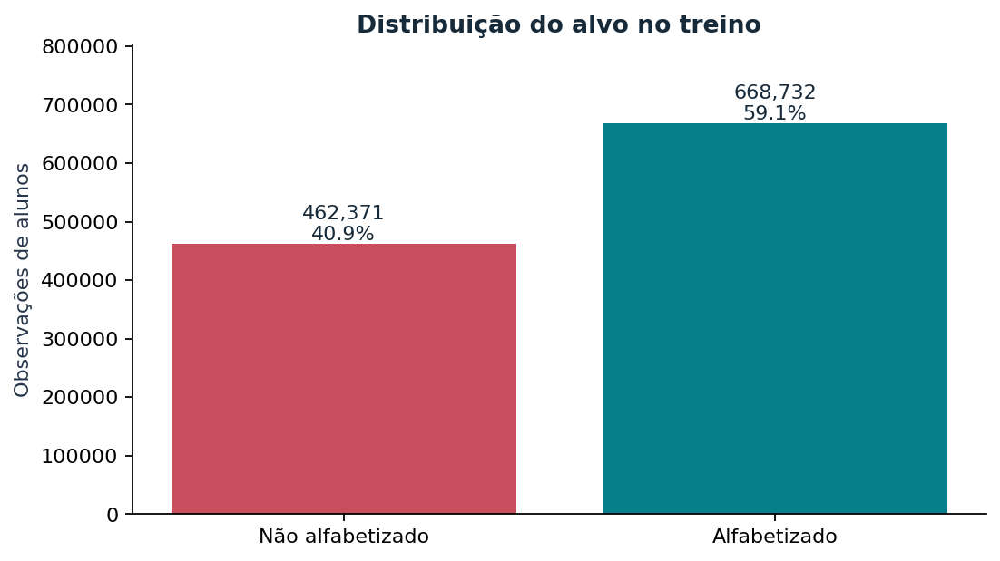

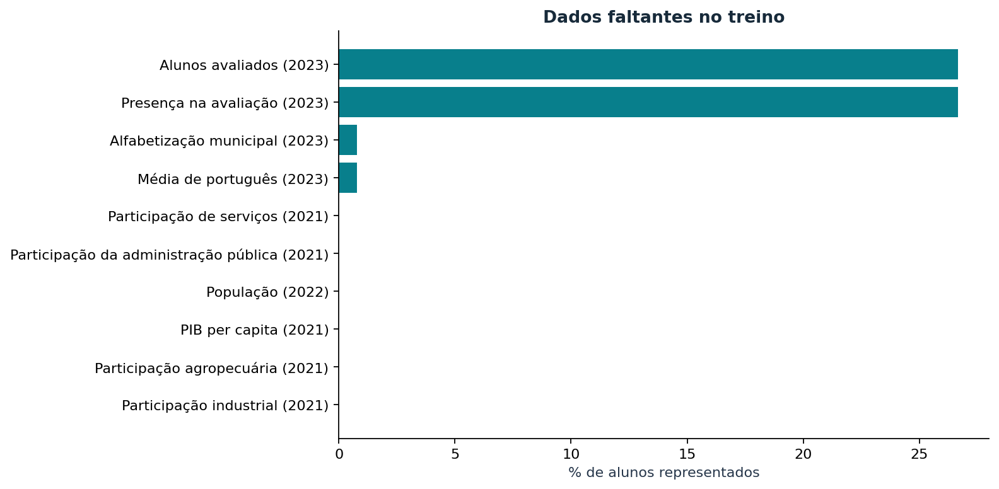

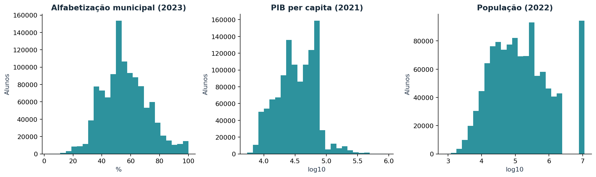

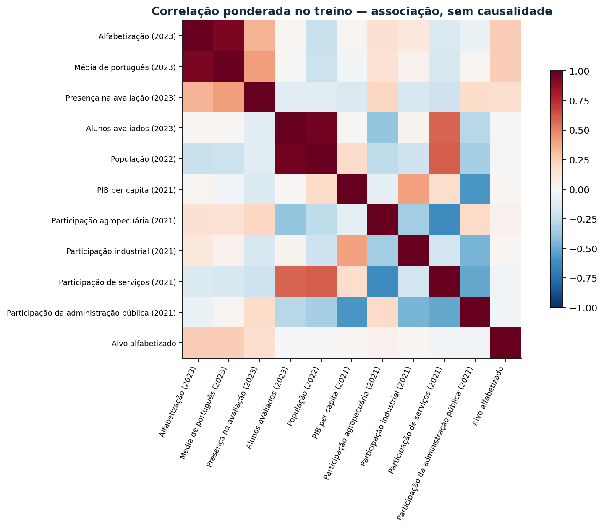

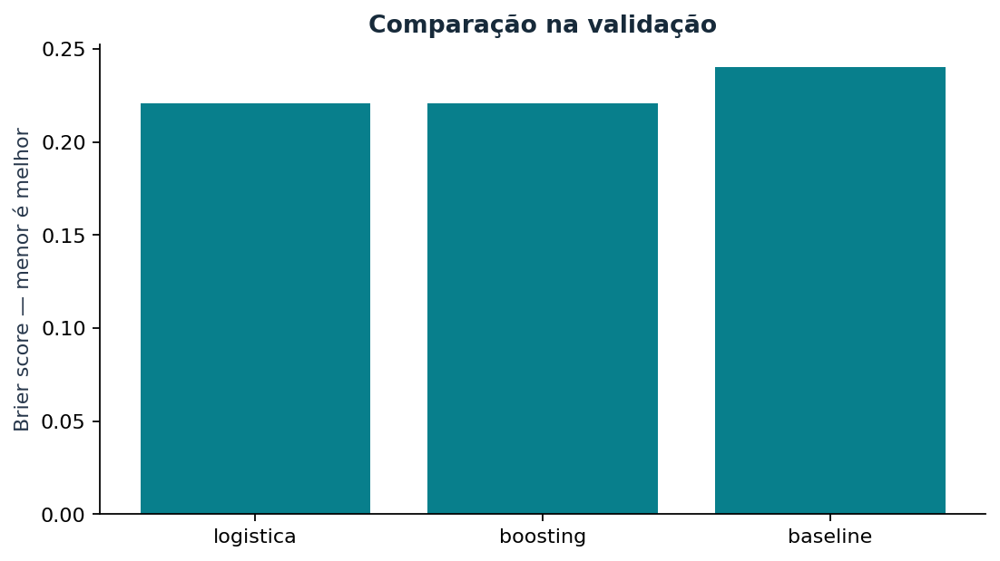

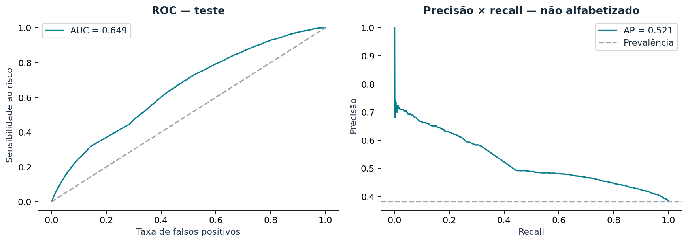

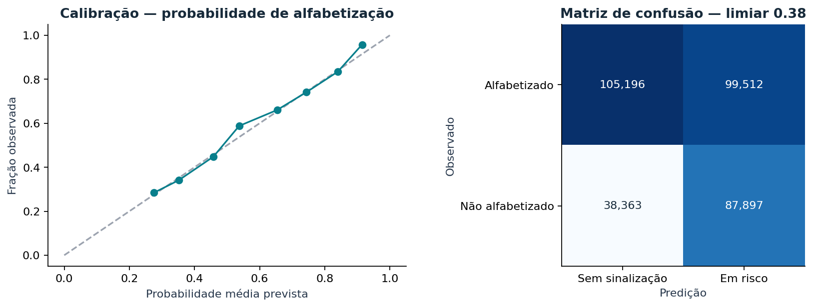

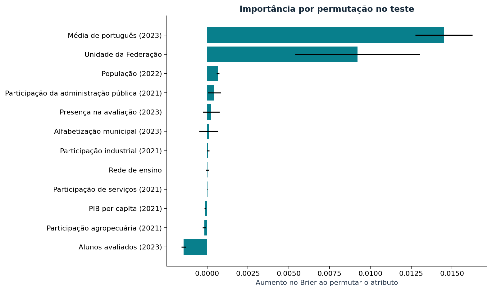

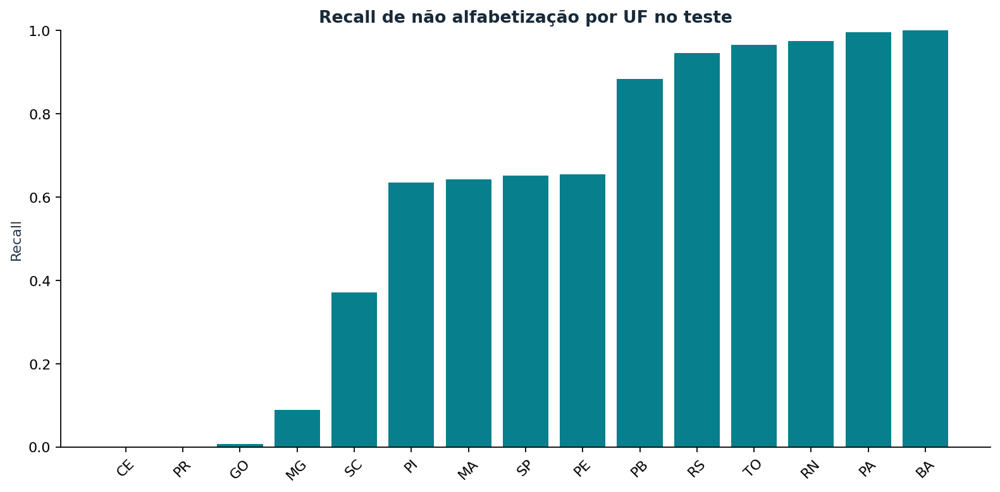

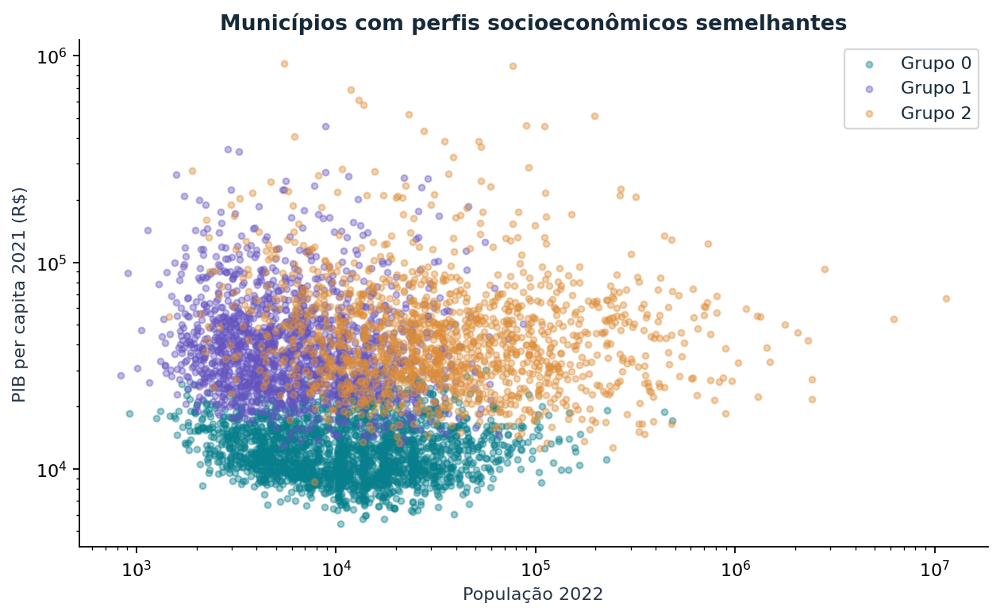

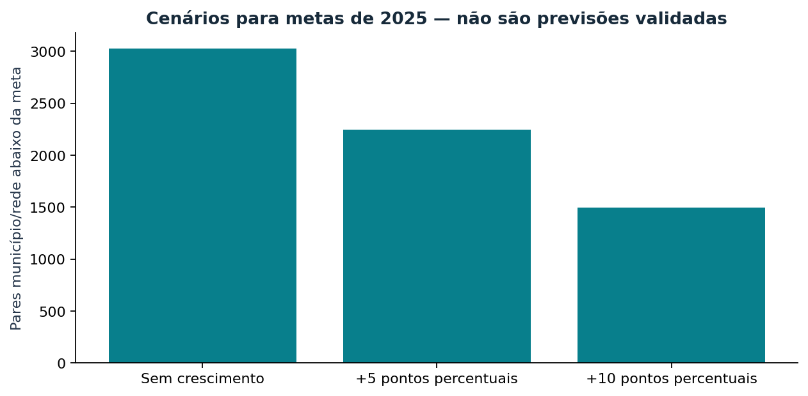
